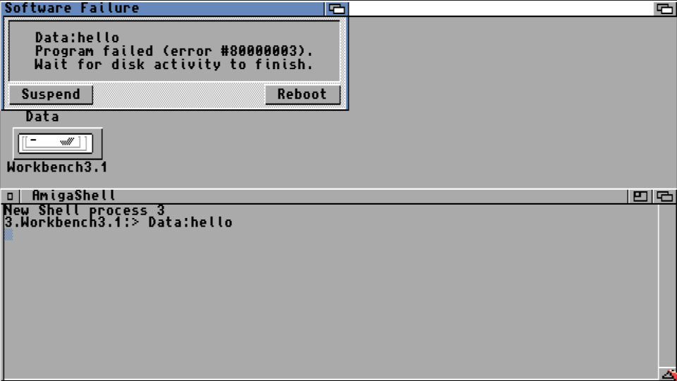

# Dockerfile for AmigaOS Cross-Compiler Toolchain

`Dockerfile` for [Stefan "Bebbo" Franke](https://github.com/bebbo)'s [fork](https://github.com/bebbo/amigaos-cross-toolchain) of [Krystian Bacławski](https://github.com/cahirwpz)'s [AmigaOS Cross-Compiler Toolchain](https://github.com/cahirwpz/amigaos-cross-toolchain).

A ready-to-use image built from this Dockerfile is available on [Docker Hub](https://hub.docker.com/r/sebastianbergmann/m68k-amigaos-bebbo/).


## "Hello world!" Example

### C

#### AmigaOS C API

`hello.c` from [Radosław Kujawa](https://github.com/Sakura-IT/Amiga-programming-examples/tree/master/C/hello-world-amiga):

```c
#include <proto/exec.h>
#include <proto/dos.h>

int main(int argc, void *argv[])
{
    struct Library *SysBase;
    struct Library *DOSBase;

    SysBase = *((struct Library **)4UL);
    DOSBase = OpenLibrary("dos.library", 0);

    if (DOSBase) {
        Write(Output(), "Hello world!\n", 13);
        CloseLibrary(DOSBase);
    }

    return(0);
}
```


#### Standard C Library

`hello.c` from [Radosław Kujawa](https://github.com/Sakura-IT/Amiga-programming-examples/tree/master/C/hello-world):

```c
#include <stdio.h>

int main()
{
    printf("Hello world!\n");

    return(0);
}
```


#### Compilation

```
$ docker run -v $HOME:/host -it sebastianbergmann/m68k-amigaos-bebbo \
  m68k-amigaos-gcc /host/hello.c -o /host/hello -noixemul
```


### Assembly

`hello.s` from [Grzegorz Kraszewski](https://github.com/Sakura-IT/Amiga-programming-examples/tree/master/ASM/HelloWorld):

```assembly
SysBase      = 4
OpenLibrary  = -552
CloseLibrary = -414
PutStr       = -948

             LEA     DosName,A1
             MOVEQ   #36,D0
             MOVEA.L SysBase,A6
             JSR     OpenLibrary(A6)

             TST.L   D0
             BEQ.S   NoDos

             MOVE.L  #Hello,D1
             MOVEA.L D0,A6
             JSR     PutStr(A6)

             MOVEA.L A6,A1
             MOVEA.L SysBase,A6
             JSR     CloseLibrary(A6)

NoDos        CLR.L   D0
             RTS

DosName      DC.B    "dos.library",0
Hello        DC.B    "Hello World!",10,0
```

```
$ docker run -v $HOME:/host -it sebastianbergmann/m68k-amigaos-bebbo \
  vasm -Fhunkexe -o /host/hello /host/hello.s
```

### Execution

#### Docker-ized Emulation using FS-UAE

The `docker-execute-amiga` script used below can be downloaded from [here](https://raw.githubusercontent.com/sebastianbergmann/docker-execute-amiga/master/docker-execute-amiga.sh).

```
$ docker-execute-amiga helloworld
```




#### Docker-ized Emulation using Virtual AmigaOS (vamos)

```
$ docker run -v $HOME:/host sebastianbergmann/amitools:latest \
  vamos -C 68020 /host/hello
Hello world!
```

